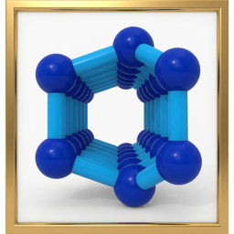

# PydSEAMSlib

[](https://colab.research.google.com/github/d-SEAMS/PydSEAMSlib/blob/main/notebooks/classify_ice.ipynb)

<p align="center">
  
</p>

[](https://builtwithnix.org)

Python bindings for the [d-SEAMS](https://dseams.info) C++ engine
([`seams-core`](https://github.com/d-SEAMS/seams-core)).

This repository is the Python package `pydseams`. The C++ engine and
`seams` CLI live in [`seams-core`](https://github.com/d-SEAMS/seams-core).
Lua/Fennel is `dseams` in [`yodaStruct`](https://github.com/d-SEAMS/yodaStruct).
Neighbour search is [`linkcell`](https://github.com/d-SEAMS/linkcell).
Do not grow a second engine here. `import pydseamslib` still works.

```bash
pip install pydseamslib
pip install 'pydseamslib[ase]'      # ASE Atoms
pip install 'pydseamslib[solvis]'   # solvis / PyVista
```

Nix flake:

```bash
nix build
nix develop
```

Docs: `docs/orgmode/` (ox-rst) and `docs/source/` (Shibuya).
Site: <https://d-seams.github.io/PydSEAMSlib/>.

```python
import pydseams as ds

frame = ds.read("water.lammpstrj")   # also .xyz, .pdb, .gro, .dcd, .con
print(frame.chill_plus())
print(frame.cages())
print(frame.density(bins=100, axis="z"))

mixed = ds.read("ions.lammpstrj", all_atoms=True, atom_type=1)
sites = ds.yoda.parseSiteSpec("1=polar,2=apolar")
print(mixed.domain(sites, ds.yoda.Kind.polar))

ions = ds.yoda.parseSiteSpec("1=cationHead,2=anion")
print(mixed.pairs(ions))

frame = ds.from_ase(atoms)
atoms = frame.to_ase()
system = frame.to_solvis()           # optional extra
```

`ds.read` picks the engine reader from the suffix. `yoda` is the compiled
surface. Helpers (`Frame`, `io`, ASE, solvis) stay in Python.
`_core` and `cyoda` still name the same module.

`Frame.density`, `Frame.pairs`, and `Frame.domain` expose the same
site-resolved density, ion-pair, and connected-domain analyses as the CLI.
Use `ds.read(..., all_atoms=True)` when a site analysis needs every LAMMPS
type; `atom_type` still selects the species used by neighbour and ice methods.
ASE adapters accept nonsingular cells periodic in all three directions and
preserve cell orientation and displacement on roundtrip. Hydrogen donors use
an ASE ``mol-id`` array when present and periodic nearest-atom ownership
otherwise. All-atom ASE imports (``select=None``) use cutoff bonding;
hydrogen-bond topology requires a heavy-atom selection such as ``select="O"``.

Cutoff, frame, and *k* follow the same twelve-factor table as
`seams`: `SEAMS_CONFIG` or `./seams.env`, then the environment, then
the function argument. `pydseams.config` is the reader.

Primary author: Ruhila S. The project started as PSF GSoC 2023 (`pyseams`).

Requires Python 3.12+. Wheels are built against the CPython 3.12 stable
ABI (one `abi3` wheel per platform). Free-threaded CPython has no
limited ABI and is not a target.

# License

[MIT](LICENSE).
